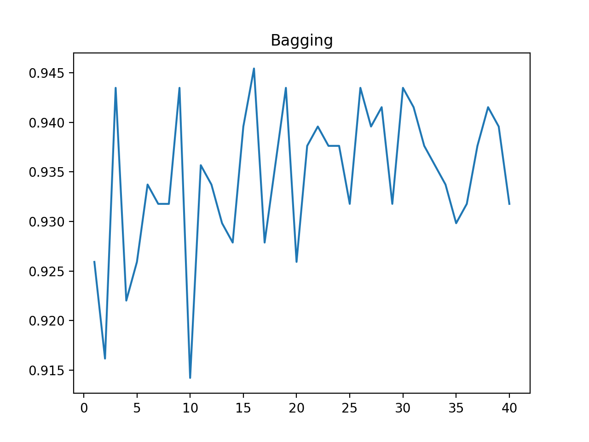
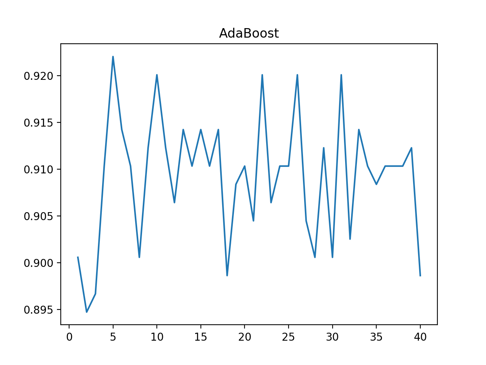
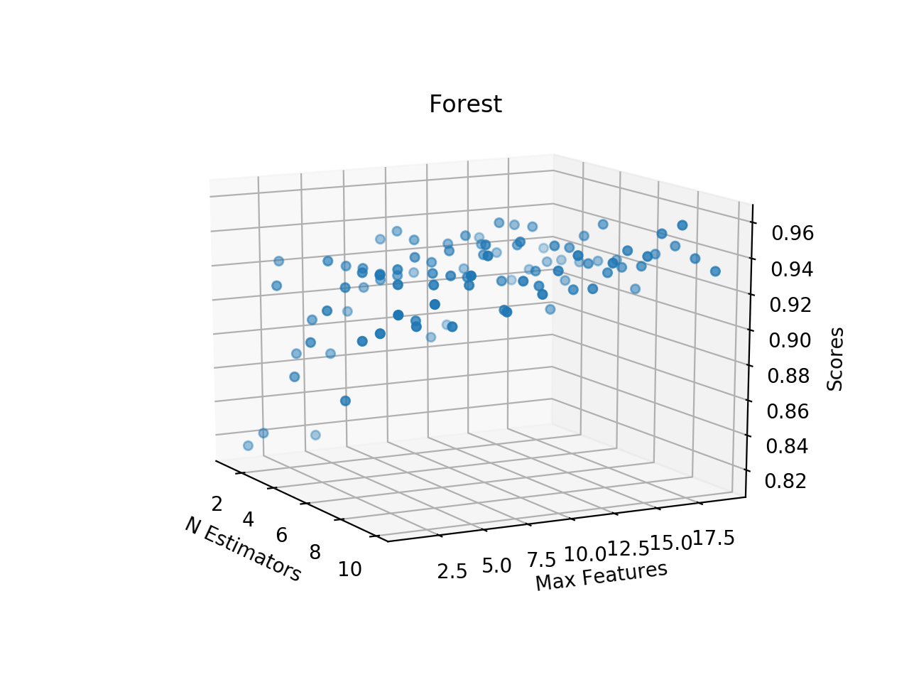

# Lab 9 Report

The following are graphs showing the classification accuracy of the decision tree using scikit learn.

<figure>
    
    <figcaption>Figure 1: Bagging Score</figcaption>
</figure>

<figure>
    
    <figcaption>Figure 2: AdaBoost Score</figcaption>
</figure>

<figure>
    
    <figcaption>Figure 3: Forest Score</figcaption>
</figure>
